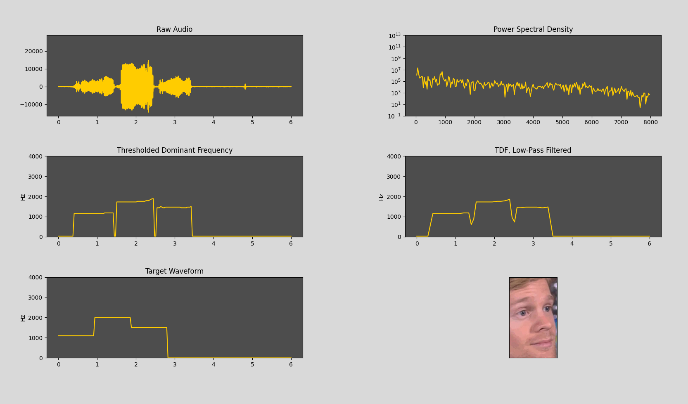

# tune-hci
Communicate with computers by whistling at them

### An example to play with
Plot (live!) the audio from your mic, visualizing the steps to extract tunes from it.  
Try to get the guy to open his eyes by whistling the target waveform correctly.

